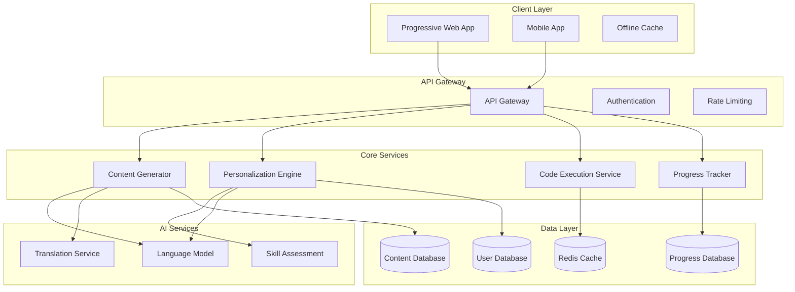

# Design Document: SmartLearn AI

## Overview

SmartLearn AI is designed as a mobile-first, AI-powered learning assistant specifically optimized for Indian students and beginner developers in Tier-2 and Tier-3 cities. The system addresses key challenges including limited bandwidth, language barriers, and lack of access to quality programming education resources.

The architecture prioritizes lightweight, offline-capable components with intelligent content adaptation based on user context, skill level, and device capabilities. The system leverages modern AI techniques for personalized learning while maintaining compatibility with low-end Android devices and 2G internet connections.

## Architecture

### High-Level Architecture



### Mobile-First Design Principles

1. **Progressive Web App (PWA)**: Primary interface optimized for mobile browsers
2. **Offline-First**: Critical content cached locally for offline access
3. **Adaptive Loading**: Content quality adjusts based on connection speed
4. **Touch-Optimized**: Interface designed for small screens and touch interaction

## Components and Interfaces

### Content Generator Service

**Purpose**: Generates programming explanations and code examples tailored to user skill level and language preferences.

**Key Interfaces**:
```typescript
interface ContentRequest {
  topic: string;
  skillLevel: SkillLevel;
  language: 'en' | 'hi';
  programmingLanguage: 'python' | 'java';
  contextualInfo?: string;
}

interface ContentResponse {
  explanation: string;
  codeExamples: CodeExample[];
  prerequisites: string[];
  nextTopics: string[];
  estimatedReadTime: number;
}

interface CodeExample {
  code: string;
  language: 'python' | 'java';
  comments: string[];
  expectedOutput: string;
  difficulty: 'basic' | 'intermediate' | 'advanced';
}
```

**Content Adaptation Logic**:
- Explanations limited to 200 words for mobile readability
- Indian context examples (e.g., using rupees in calculations, Indian names)
- Progressive complexity based on user skill assessment
- Bilingual support with context-aware translation

### Personalization Engine

**Purpose**: Tracks user progress, assesses skill levels, and provides personalized learning recommendations.

**Key Interfaces**:
```typescript
interface UserProfile {
  userId: string;
  skillLevel: SkillLevel;
  preferredLanguage: 'en' | 'hi';
  programmingLanguages: ('python' | 'java')[];
  learningGoals: string[];
  weakAreas: string[];
  strengths: string[];
}

interface LearningRecommendation {
  nextTopic: string;
  reason: string;
  estimatedDuration: number;
  prerequisites: string[];
  difficulty: number;
}

interface SkillAssessment {
  topic: string;
  currentLevel: number; // 0-100
  confidence: number; // 0-100
  lastAssessed: Date;
  improvementAreas: string[];
}
```

**Personalization Algorithms**:
- Bayesian knowledge tracing for skill level estimation
- Collaborative filtering for topic recommendations
- Spaced repetition scheduling for concept reinforcement
- Adaptive difficulty adjustment based on performance patterns

### Code Execution Service

**Purpose**: Provides secure, sandboxed code execution for Python and Java with educational feedback.

**Key Interfaces**:
```typescript
interface CodeExecutionRequest {
  code: string;
  language: 'python' | 'java';
  userId: string;
  timeLimit: number; // seconds
  memoryLimit: number; // MB
}

interface CodeExecutionResponse {
  output: string;
  errors: ExecutionError[];
  executionTime: number;
  memoryUsed: number;
  suggestions: string[];
  status: 'success' | 'error' | 'timeout';
}

interface ExecutionError {
  type: 'syntax' | 'runtime' | 'logic';
  message: string;
  line: number;
  suggestion: string;
  severity: 'error' | 'warning';
}
```

**Security Features**:
- Docker-based sandboxing for code isolation
- Resource limits (CPU, memory, execution time)
- Network access restrictions
- File system access controls
- Input/output sanitization

### Progress Tracker

**Purpose**: Monitors learning progress, maintains streaks, and provides motivational feedback.

**Key Interfaces**:
```typescript
interface LearningSession {
  userId: string;
  startTime: Date;
  endTime: Date;
  topicsCovered: string[];
  exercisesCompleted: number;
  codeExecutions: number;
  skillImprovements: SkillChange[];
}

interface ProgressSummary {
  totalLearningTime: number;
  currentStreak: number;
  longestStreak: number;
  topicsCompleted: number;
  totalTopics: number;
  achievements: Achievement[];
  weeklyProgress: WeeklyStats[];
}

interface Achievement {
  id: string;
  title: string;
  description: string;
  unlockedAt: Date;
  category: 'streak' | 'skill' | 'practice' | 'milestone';
}
```

## Data Models

### User Data Model

```typescript
interface User {
  id: string;
  email: string;
  name: string;
  createdAt: Date;
  lastActiveAt: Date;
  
  // Profile Information
  profile: UserProfile;
  
  // Learning State
  currentTopic: string;
  completedTopics: string[];
  skillAssessments: Map<string, SkillAssessment>;
  
  // Preferences
  preferences: {
    language: 'en' | 'hi';
    programmingLanguages: ('python' | 'java')[];
    notificationsEnabled: boolean;
    offlineMode: boolean;
    dataUsageMode: 'low' | 'medium' | 'high';
  };
  
  // Progress Tracking
  stats: {
    totalLearningTime: number;
    currentStreak: number;
    longestStreak: number;
    lastLearningDate: Date;
  };
}
```

### Content Data Model

```typescript
interface LearningContent {
  id: string;
  topic: string;
  title: string;
  description: string;
  
  // Content Variants
  explanations: {
    [key in 'en' | 'hi']: {
      [level in SkillLevel]: string;
    };
  };
  
  // Code Examples
  codeExamples: {
    python: CodeExample[];
    java: CodeExample[];
  };
  
  // Learning Path
  prerequisites: string[];
  nextTopics: string[];
  estimatedDuration: number;
  difficulty: number;
  
  // Metadata
  tags: string[];
  category: string;
  createdAt: Date;
  updatedAt: Date;
}
```

### Progress Data Model

```typescript
interface UserProgress {
  userId: string;
  topicId: string;
  
  // Progress Metrics
  completionPercentage: number;
  timeSpent: number;
  attemptsCount: number;
  lastAccessedAt: Date;
  
  // Performance Data
  exerciseScores: number[];
  codeExecutionCount: number;
  errorPatterns: string[];
  
  // Learning Analytics
  learningVelocity: number; // topics per hour
  retentionScore: number; // 0-100
  engagementLevel: number; // 0-100
}
```

## Correctness Properties

*A property is a characteristic or behavior that should hold true across all valid executions of a system—essentially, a formal statement about what the system should do. Properties serve as the bridge between human-readable specifications and machine-verifiable correctness guarantees.*

Before defining the correctness properties, I need to analyze the acceptance criteria from the requirements document to determine which ones are testable as properties.

### Converting EARS to Properties

Based on the prework analysis, I'll convert the testable acceptance criteria into universally quantified properties:

**Property 1: Content Length Compliance**
*For any* programming concept request, the generated explanation should be under 200 words while remaining complete and clear
**Validates: Requirements 1.1**

**Property 2: Prerequisite Ordering**
*For any* programming concept with prerequisites, those prerequisite concepts should be explained before the main concept in the generated content
**Validates: Requirements 1.3**

**Property 3: Bilingual Content Generation**
*For any* programming concept, requesting content in Hindi should return Hindi explanations and requesting in English should return English explanations
**Validates: Requirements 1.4**

**Property 4: Multi-Language Code Generation**
*For any* programming concept request, the system should generate syntactically valid and executable code examples in both Python and Java
**Validates: Requirements 2.1, 2.3**

**Property 5: Code Example Completeness**
*For any* generated code example, it should include detailed comments and expected output
**Validates: Requirements 2.2, 2.5**

**Property 6: Progressive Complexity**
*For any* set of code examples for a concept, the examples should be ordered from simple to complex based on measurable complexity metrics
**Validates: Requirements 2.4**

**Property 7: New User Assessment**
*For any* newly created user account, the personalization engine should initiate a skill assessment process
**Validates: Requirements 3.1**

**Property 8: Progress Updates**
*For any* completed learning activity, the user's skill level and progress metrics should be updated to reflect the completion
**Validates: Requirements 3.2**

**Property 9: Personalized Recommendations**
*For any* user with different skill levels or progress states, the system should generate different learning recommendations
**Validates: Requirements 3.3**

**Property 10: Difficulty-Based Assistance**
*For any* user showing struggle patterns with a concept, the system should suggest prerequisite topics or alternative explanations
**Validates: Requirements 3.4**

**Property 11: Language-Aware Recommendations**
*For any* two users with identical progress but different programming language preferences, their learning recommendations should differ appropriately
**Validates: Requirements 3.5**

**Property 12: Session Recording**
*For any* completed learning session, the progress tracker should create a record containing session duration and topics covered
**Validates: Requirements 4.1**

**Property 13: Progress Indicator Accuracy**
*For any* programming concept, the displayed completion percentage should accurately reflect the user's actual progress through that concept
**Validates: Requirements 4.2**

**Property 14: Progress Display Completeness**
*For any* user progress view, it should include current learning streaks and earned achievements
**Validates: Requirements 4.3**

**Property 15: Learning Summaries**
*For any* user, the system should be able to generate both weekly and monthly learning summaries covering their activity
**Validates: Requirements 4.4**

**Property 16: Inactivity Notifications**
*For any* user who hasn't engaged with the system for 3 consecutive days, a reminder notification should be triggered
**Validates: Requirements 4.5**

**Property 17: Offline Content Access**
*For any* content previously accessed by a user, it should remain available when the user is offline
**Validates: Requirements 5.2**

**Property 18: Adaptive Content Loading**
*For any* poor connectivity scenario, the system should prioritize text content over multimedia content
**Validates: Requirements 5.3**

**Property 19: Interface Language Support**
*For any* user interface element, it should be displayable in both English and Hindi
**Validates: Requirements 5.4**

**Property 20: Multi-Language Code Editor**
*For any* practice session request, the system should provide functional code editors for both Python and Java
**Validates: Requirements 6.1**

**Property 21: Safe Code Execution**
*For any* valid user code submission, the system should execute it safely and return results without compromising system security
**Validates: Requirements 6.2**

**Property 22: Error Feedback Quality**
*For any* code submission containing errors, the system should provide helpful error explanations and improvement suggestions
**Validates: Requirements 6.3**

**Property 23: Skill-Appropriate Challenges**
*For any* user at a specific skill level, the coding challenges offered should match their proficiency level
**Validates: Requirements 6.4**

**Property 24: Exercise Feedback**
*For any* completed coding exercise, the system should generate feedback and improvement suggestions
**Validates: Requirements 6.5**

**Property 25: Curriculum Sequencing**
*For any* programming concept in the curriculum, it should be positioned after its prerequisites and before concepts that depend on it
**Validates: Requirements 7.1, 7.3**

**Property 26: Curriculum Completeness**
*For any* fundamental programming concept (variables, loops, functions, OOP), it should be included in the learning curriculum
**Validates: Requirements 7.2**

**Property 27: Multi-Concept Projects**
*For any* practical project in the curriculum, it should integrate and reference multiple programming concepts
**Validates: Requirements 7.4**

**Property 28: Contextual Help Response**
*For any* user request for help or indication of confusion, the learning assistant should provide additional explanations or alternative approaches
**Validates: Requirements 8.1**

**Property 29: Proactive Assistance**
*For any* user exhibiting common learning difficulty patterns, the system should proactively offer assistance
**Validates: Requirements 8.2**

**Property 30: Contextual Question Answering**
*For any* user question, the learning assistant should provide answers that are contextually relevant to the user's current learning topic
**Validates: Requirements 8.3**

**Property 31: Conversation Continuity**
*For any* user interaction with the learning assistant, the conversation history should be maintained and influence subsequent responses
**Validates: Requirements 8.4**

**Property 32: Emotional Support Response**
*For any* user expressing frustration or discouragement, the learning assistant should offer encouragement and suggest appropriate coping strategies
**Validates: Requirements 8.5**

## Error Handling

### Content Generation Errors
- **Timeout Handling**: If AI content generation exceeds 10 seconds, return cached fallback content
- **Language Detection Failures**: Default to English if language detection fails
- **Code Compilation Errors**: Validate generated code before serving; regenerate if invalid
- **Content Length Violations**: Automatically truncate explanations exceeding 200 words while preserving meaning

### Code Execution Errors
- **Sandbox Failures**: Gracefully handle container startup failures with informative error messages
- **Resource Exhaustion**: Terminate processes exceeding memory/CPU limits with educational feedback
- **Security Violations**: Block and log attempts to access restricted resources
- **Network Timeouts**: Implement circuit breakers for external service dependencies

### Personalization Errors
- **Assessment Failures**: Provide default skill level if assessment cannot be completed
- **Recommendation Engine Downtime**: Fall back to static curriculum progression
- **Progress Sync Issues**: Queue progress updates for retry during connectivity issues
- **User State Corruption**: Implement data validation and recovery mechanisms

### Offline Mode Errors
- **Cache Corruption**: Validate cached content integrity and re-download if necessary
- **Storage Limitations**: Implement intelligent cache eviction based on usage patterns
- **Sync Conflicts**: Resolve conflicts using last-write-wins with user notification
- **Partial Downloads**: Resume interrupted content downloads automatically

## Testing Strategy

### Dual Testing Approach

The testing strategy employs both unit testing and property-based testing to ensure comprehensive coverage:

**Unit Tests**: Focus on specific examples, edge cases, and integration points
- Test specific content generation scenarios with known inputs/outputs
- Verify error handling for edge cases (empty inputs, malformed requests)
- Test integration between components (API endpoints, database operations)
- Validate security measures (authentication, authorization, input sanitization)

**Property-Based Tests**: Verify universal properties across all inputs
- Generate random programming concepts and verify content generation properties
- Test personalization algorithms with varied user profiles and progress states
- Validate code execution safety with randomly generated code samples
- Verify curriculum consistency across different learning paths

### Property-Based Testing Configuration

**Testing Framework**: Use Hypothesis (Python) for property-based testing
- Minimum 100 iterations per property test to ensure statistical confidence
- Custom generators for domain-specific data (programming concepts, user profiles, code samples)
- Shrinking strategies to find minimal failing examples
- Deterministic seeding for reproducible test runs

**Test Tagging**: Each property test must reference its design document property
- Tag format: **Feature: smartlearn-ai, Property {number}: {property_text}**
- Example: **Feature: smartlearn-ai, Property 1: Content Length Compliance**

**Coverage Requirements**:
- All 32 correctness properties must have corresponding property-based tests
- Unit test coverage minimum 80% for critical paths
- Integration test coverage for all API endpoints
- Performance tests for mobile optimization requirements

### Test Data Management

**Synthetic Data Generation**:
- Programming concept hierarchies with realistic prerequisite relationships
- User profiles representing diverse skill levels and learning patterns
- Code samples in Python and Java covering various complexity levels
- Multilingual content samples for translation testing

**Test Environment**:
- Isolated test databases with realistic data volumes
- Mock external services (AI APIs, translation services)
- Containerized test environments for consistent execution
- Automated test data cleanup and regeneration